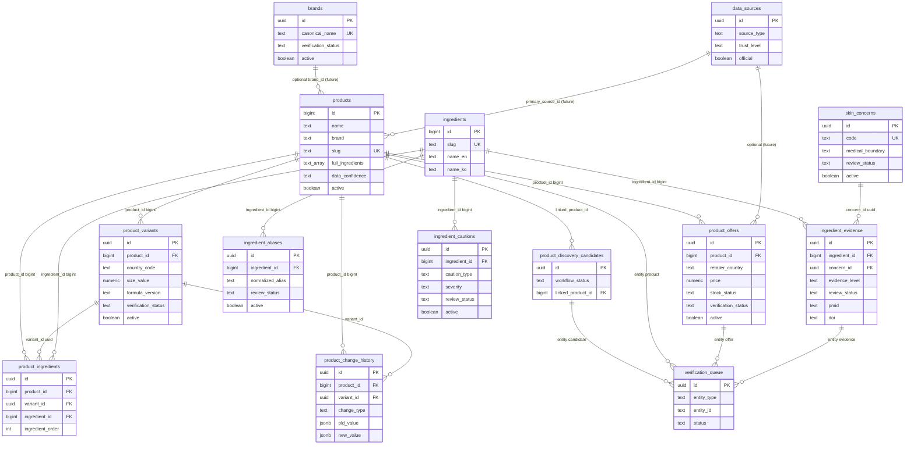
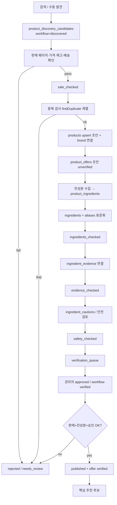

# docs/32-search-to-verified-erd.md — ERD & 데이터 흐름

최종 갱신: 2026-07-13  
상태: **설계 전용**  
상세 컬럼: `docs/31-search-to-verified-data-model.md`

---

## 1. Mermaid ERD (기존 + 신규)



---

## 2. 주요 관계 요약

| 관계 | 카디널리티 | 키 타입 |
|------|------------|---------|
| products → product_offers | 1:N | bigint → uuid rows |
| products → product_variants | 1:N | bigint → uuid |
| products → product_ingredients | 1:N | bigint |
| variants → product_ingredients | 1:N (optional) | uuid |
| ingredients → product_ingredients | 1:N | bigint |
| ingredients → ingredient_evidence | 1:N | bigint |
| skin_concerns → ingredient_evidence | 1:N | uuid |
| discovery → products | N:0..1 | linked_product_id bigint |
| queue → 다형 엔티티 | N:1 | entity_type + entity_id text |

**분리 원칙**

- Product = 무엇인지  
- Variant = 어떤 버전/용량/국가 공식  
- Offer = 어디서 얼마에 살 수 있는지  
- ProductIngredient = 무엇이 순서대로 들어갔는지  
- IngredientEvidence = 성분이 어떤 고민에 어떤 근거로 연결되는지 (제품 효능 단정 아님)

---

## 3. 발견 → published 데이터 흐름



### 테이블 쓰기 시점

| 단계 | 주로 쓰는 테이블 |
|------|------------------|
| 검색 | `product_discovery_candidates`, `data_sources` |
| 판매 확인 | candidates, 이후 `product_offers` |
| 제품 확정 | `products`, `brands`, `product_variants` |
| 전성분 | `ingredients`, `ingredient_aliases`, `product_ingredients` |
| 근거 | `skin_concerns`, `ingredient_evidence` |
| 안전 | `ingredient_cautions` |
| 승인 | `verification_queue`, status 필드 |
| 이력 | `product_change_history` |
| 추천 노출 | `products`(published) + `product_offers`(verified+in_stock) |

---

## 4. 기존 DB와의 공존

```text
[레거시]
products.brand text ──────────────┐
products.full_ingredients text[]  │  병행 기간
products.link_* / price_usd       │
ingredients.paper_1_* / paper_2_* ┘

[정본 목표]
brands.canonical_name
product_ingredients (ordered)
product_offers
ingredient_evidence
```

레거시 필드를 즉시 DROP하지 않는다. 정본이 채워진 뒤 읽기 경로를 전환한다.

---

## 5. 국가 확장 (KR → US/JP)

- `product_variants.country_code`  
- `product_offers.retailer_country` / `ships_to_countries` (기존)  
- `product_discovery_candidates.discovered_country`  
- `data_sources.country_code`  
- `brands.country_code`  

한국 MVP는 KR offer + KR 배송 검증을 기본 게이트로 사용한다.
