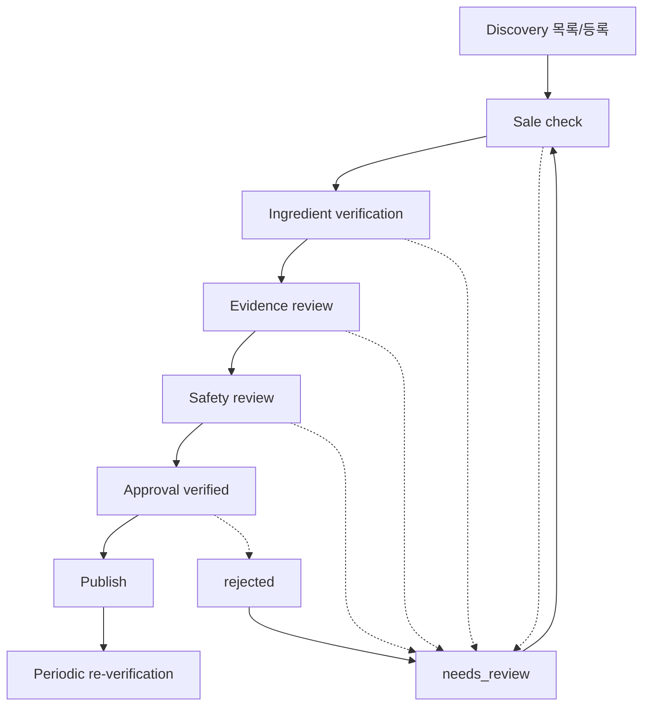

# docs/38-admin-verification-ui.md — 관리자 검증 파이프라인 UI 설계

최종 갱신: 2026-07-13  
상태: **설계 전용** (구현·migration·원격 변경 없음)  
관련: `docs/34-product-verification-workflow.md`, `docs/39`~`docs/42`

---

## 0. 현재 코드 기준선 (조사 결과)

| 항목 | 현재 상태 |
|------|-----------|
| 관리자 페이지 | `/admin/catalog-review`만 존재 (development only, 로그인 없음) |
| API | `/api/analyze`만 존재 |
| middleware | **없음** |
| Supabase client | `src/lib/supabase.ts` — anon key 브라우저/공용 client만 |
| service_role client | **없음** |
| Zod | **미도입** (수동 validation) |
| Auth/세션 | 앱에 관리자 로그인·세션 검증 없음 |
| `profiles` | 원격 존재 (`id`, `email`, `role` text 등). 앱 연동 미구현 |

**선행 과제:** 관리자 인증·role 게이트(별도). 본 UI는 그 이후 구현한다.  
구현 전 production에서 `/admin/*`는 404 또는 인증 리다이렉트여야 한다.

---

## 1. 정보 구조 (IA)

```text
/admin                         대시보드
├── /admin/discovery           검색 후보 목록
│   └── /admin/discovery/[id]  후보 상세·단계 검증
├── /admin/products            제품 목록 (기존 186 포함)
│   └── /admin/products/[id]   제품 상세
├── /admin/ingredients         성분 마스터
│   └── /admin/ingredients/[id]
├── /admin/evidence            근거 검토 큐
│   └── /admin/evidence/[id]   (선택: 상세 모달 또는 페이지)
├── /admin/verification        verification_queue
├── /admin/sources             data_sources
└── /admin/history             product_change_history
```

기존 `/admin/catalog-review`는 Sprint 14 개발용 로컬 카탈로그 뷰로 유지.  
Search-to-Verified 운영 UI와 역할을 혼동하지 않도록 내비에 **Dev only** 라벨을 유지한다.

---

## 2. 공통 UX 규칙

### 2.1 레이아웃
- 좌측 내비(또는 상단 탭): 파이프라인 단계 순서와 동일한 메뉴 순서
- 상단: 관리자 표시명·role 배지·로그아웃
- 본문: 목록/상세. 카드 남용 금지 — 테이블·탭·단계 패널 중심
- `robots: noindex,nofollow`

### 2.2 상태 배지

| 배지 | 색 의도 | 대상 |
|------|---------|------|
| discovered | 중립 회색 | workflow |
| sale_checked ~ safety_checked | 단계별 파랑 계열 | workflow |
| verified | 보라(게이트 통과, 미공개) | workflow |
| published | 초록 | workflow / 추천 가능 |
| needs_review | 주황 | 보류 |
| rejected | 빨강 | 반려 |
| pending / in_review / approved | 공통 검토 상태 | entity review |

용어 혼용 금지:
- offer `verified` ≠ workflow `verified` ≠ 행 `approved`

### 2.3 빈 상태
- 데이터 0행: “아직 후보가 없습니다. 검색 결과만으로 published 하지 마세요.”
- 필터 결과 0: “조건에 맞는 항목 없음” + 필터 초기화

### 2.4 오류 상태
- 401/403: 로그인·권한 안내
- 409 충돌: `updated_at` 불일치 → 새로고침 유도
- 422 게이트 실패: 실패한 필수 조건 체크리스트 표시
- 5xx: 일반 메시지 (DB 원문 비노출)

### 2.5 위험 작업 UX
- **Publish / Reject / 단종(active=false)** 는 확인 모달 필수
- Publish 모달: 서버가 반환한 15항 체크리스트 재표시
- 가짜 URL·가격·재고·논문 입력 금지 안내를 폼 상단에 고정
- 의료 위험 신호(고강도 caution / medical_boundary) 시 **피부과 안내 우선** 배너

### 2.6 삭제 정책
- 물리 DELETE UI 없음
- `active=false`, `rejected`, `needs_review`, `discontinued_at` 사용

---

## 3. 화면별 설계

### 3.1 `/admin` — 대시보드

**목적:** 파이프라인 운영 요약. 한눈에 병목·위험·publish 가능 건수.

| 위젯 | 데이터 소스 |
|------|-------------|
| workflow_status별 후보 수 | `product_discovery_candidates` |
| 검토 대기(queue pending/in_review) | `verification_queue` |
| published 가능 후보 | verified + 게이트 통과 가능 추정 (서버 집계) |
| needs_review / rejected | candidates |
| 최근 변경 10건 | `product_change_history` |
| 재검증 필요 | offer `last_checked_at` 오래됨 / needs_review |
| 기존 products 186 경고 | “자동 published 금지” 고정 문구 |

버튼:
- Discovery로 이동
- Verification 대기 목록
- (권한 있을 때만) Publish 가능 목록 필터 링크

---

### 3.2 `/admin/discovery` — 후보 목록

**목적:** 검색으로 발견된 후보 운영.

| 컬럼 | 필드 |
|------|------|
| 제품명 | discovered_name |
| 브랜드 | discovered_brand |
| URL | discovered_url (외부 링크, 클릭 시 새 탭) |
| 국가 | discovered_country |
| 출처 유형 | source_type |
| 워크플로 | workflow_status |
| 판매/성분/근거/안전/중복 | *_check_status |
| 연결 제품 | linked_product_id |
| 담당 | assigned_to |
| 발견일 | discovered_at |

필터: workflow_status, country, source_type, assigned_to, duplicate_check_status  
정렬: discovered_at DESC 기본, priority는 queue 연동 시 보조  
검색: name / brand / URL / search_query

버튼: 신규 후보 등록(수동), 새로고침.  
자동 크롤 대량 등록 UI는 1차 범위 밖.

---

### 3.3 `/admin/discovery/[id]` — 후보 상세

**목적:** discovered → published 전 단계 검증의 단일 작업면.

#### 탭 / 단계 패널

1. **기본 정보** — name, brand, URL, country, source_type, search_query, notes, assigned_to  
2. **판매 확인** — sale_check_status, offer 초안 연결, last_checked 기록  
3. **제품/variant 매핑** — 기존 product 검색·링크, 신규 생성 후보(생성은 API만), 중복 비교  
4. **전성분** — 공식 source_url/type, product_ingredients 목록, alias 매핑  
5. **근거** — 연결 evidence, queue 생성  
6. **안전성** — caution 연결, high severity 경고, 의료 경계  
7. **출처** — data_sources 참조  
8. **변경 이력** — 해당 product/candidate 관련 history  
9. **승인 상태** — workflow, check flags, publish readiness

#### 필수 동작 (버튼 → API)

| 버튼 | 허용 role (요약) | API |
|------|------------------|-----|
| 저장(기본 정보) | catalog_manager+ | PATCH discovery |
| 판매 확인 기록 | catalog_manager+ | POST …/sale-check |
| 기존 product 연결 | catalog_manager+ | POST …/link-product |
| 전성분 저장 | catalog_manager+ | POST …/ingredients |
| 근거 연결 | researcher+ | POST …/evidence |
| 안전성 검토 | reviewer+ | POST …/safety-review |
| 검토 제출(queue) | catalog_manager+ | POST …/submit-review |
| needs_review | reviewer+ | PATCH / reject 계열 |
| Reject | reviewer+ | POST …/reject |
| Verified 게이트 | reviewer+ | POST …/approve |
| Publish | admin 또는 reviewer(정책상 분리 가능) | POST …/publish |

Publish 버튼은 readiness 실패 시 disabled + 실패 항목 목록.

---

### 3.4 `/admin/products`

**목적:** 기존 186개 포함 제품 운영. **자동 published 표시 금지.**

표시 컬럼 (현재 스키마 한계 반영):
- id, name, brand(text), active, verified_at, data_confidence
- variant 수 / offer 수 / product_ingredients 승인 수 (집계)
- pipeline_status: **컬럼 없음** → UI는 “미도입(legacy)” 또는 discovery linked 여부만 표시
- published 여부: discovery.workflow=published 또는 향후 pipeline_status (현 시점 false 기본)

경고 배너: “기존 products는 Search-to-Verified 통과 전까지 핵심 추천 published로 취급하지 않음”

---

### 3.5 `/admin/products/[id]`

탭:
- 기본 정보 (products)
- Variants (`product_variants`)
- Offers (`product_offers` — variant_id 없음 → product 단위 표시)
- Ingredients (`product_ingredients`)
- Evidence 요약 (ingredient 경유)
- Caution 요약
- 출처 / History
- 공개 미리보기 (클라이언트에 노출될 SELECT 조건 시뮬레이션)
- 추천 엔진 사용 가능 여부: published + active verified in_stock offer

---

### 3.6 `/admin/ingredients` · `/admin/ingredients/[id]`

목록: ingredients 40 + alias/evidence/caution 집계, 미검토, 중복 후보  
상세: INCI(name_en), name_ko, aliases, evidence, cautions, 연결 제품 수, review 상태

기존 `ingredients.paper_*` 컬럼은 **레거시 표시만**. 신규 근거는 `ingredient_evidence`로만 작성.

---

### 3.7 `/admin/evidence` · `[id]`

컬럼: pmid, doi, study_design, evidence_level, concern, review_status, COI, reviewed_at, reviewer  
필터: review_status, evidence_level, COI, ingredient_id  
승인/반려는 researcher 작성 → reviewer 승인 분리

---

### 3.8 `/admin/verification`

`verification_queue` 목록: priority, entity_type, review_type, status, assigned_to, reason, created_at, reviewed_at  
동작: assign, complete(approve/reject/needs_review)

---

### 3.9 `/admin/sources`

`data_sources`: source_type, name, base_url, country, trust_level, official, active  
가짜 URL 등록 금지. official=true는 검증 근거 필수.

---

### 3.10 `/admin/history`

`product_change_history`: product/variant, change_type, old/new jsonb, source_url, detected_at, reviewed_at, approved_by  
읽기 전용 기본. 정정은 새 변경으로만.

---

## 4. 파이프라인 흐름 (화면 관점)



---

## 5. 구현 범위 밖 (이번 문서)

- 실제 React 페이지·컴포넌트 작성
- Auth UI
- seed / 제품 등록
- migration / ALTER

---

## 6. 다음 문서

- API: `docs/39-admin-verification-api.md`
- 상태 전환: `docs/40-workflow-transition-policy.md`
- 역할: `docs/41-admin-role-permission.md`
- Publish 트랜잭션: `docs/42-publish-transaction-design.md`
