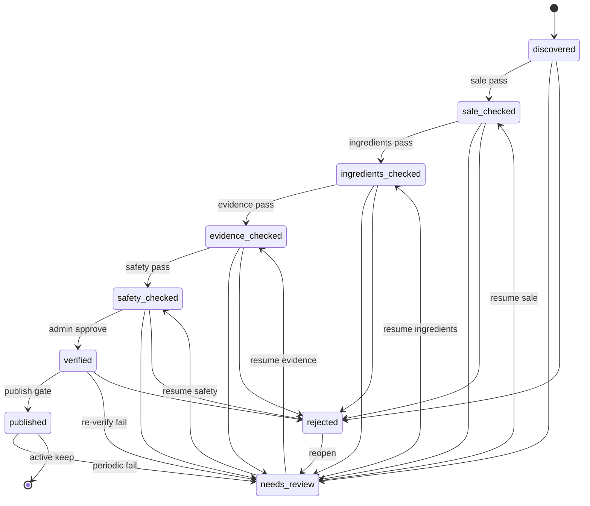

# docs/40-workflow-transition-policy.md — 워크플로 상태 전환 정책

최종 갱신: 2026-07-13  
상태: **설계 전용**  
저장 위치: `product_discovery_candidates.workflow_status`  
DB CHECK (원격 확인):  
`discovered | sale_checked | ingredients_checked | evidence_checked | safety_checked | verified | published | rejected | needs_review`

---

## 1. 용어 구분 (필수)

| 용어 | 의미 | 핵심 추천 |
|------|------|-----------|
| workflow `verified` | 파이프라인 관리자 게이트 통과 | **불가** |
| workflow `published` | 공개·추천 가능 | **가능** (offer 조건 별도) |
| offer `verification_status=verified` | 판매처 검증 | 필요 조건 |
| 행 `approved` | brands/variants/ingredients/evidence 등 공개 SELECT 게이트 | 클라이언트 가시성 |

혼용 금지.

---

## 2. Mermaid 흐름



운영 요약:

```text
discovered → sale_checked → ingredients_checked → evidence_checked
  → safety_checked → verified → published
보조: needs_review | rejected
이후: periodic re-verification
```

---

## 3. 허용 전환표

| From | To | 조건 요약 |
|------|-----|-----------|
| discovered | sale_checked | sale_check pass |
| sale_checked | ingredients_checked | 공식 전성분 + 매핑 |
| ingredients_checked | evidence_checked | 핵심 성분 evidence 검토 완료 정책 |
| evidence_checked | safety_checked | caution/의료 경계 검토 |
| safety_checked | verified | reviewer approve + queue |
| verified | published | **publish 15항 전부** (`docs/42`) |
| * (진행 중) | needs_review | 사유 필수 |
| * (진행 중, published 제외 권장) | rejected | 사유 필수 |
| needs_review | (직전 합격 단계 또는 sale_checked) | 재개 규칙 §6 |
| rejected | needs_review | reopen + 사유 |
| published | needs_review | 재검증 실패·단종 징후 |
| published | rejected | 심각한 허위/안전 이슈 (드묾, admin) |

---

## 4. 금지 전환 (직접 점프)

| From | To | 금지 이유 |
|------|-----|-----------|
| discovered | published | 검증 생략 |
| discovered | verified | 판매·성분·근거·안전 생략 |
| sale_checked | verified | 중간 단계 생략 |
| sale_checked | published | 금지 |
| ingredients_checked | published | 금지 |
| evidence_checked | published | 금지 |
| ingredients_checked | verified | 안전·근거 생략 가능 |
| any | published | publish API 외 raw UPDATE 금지 |
| rejected | published | 재개·재검증 없이 금지 |
| rejected | verified | 금지 |
| published | discovered | 이력 왜곡 |

서버는 임의 `workflow_status` text PATCH를 거부한다.  
허용 API + 전환 그래프만 통과.

---

## 5. 단계별 필수 조건

### 5.1 → sale_checked
- HTTPS 상품 URL
- 가격 표시 확인 기록
- stock ≠ out_of_stock (pass 시)
- 배송 국가
- 신뢰/공식 판매처 판단 기록
- `sale_check_status=pass`
- 검색 노출만으로 pass 불가

### 5.2 → ingredients_checked
- `linked_product_id` 권장 (없으면 notes에 신규 필요 + queue)
- 공식 `source_type` ∈ official_brand_page | official_label | official_retailer
- `source_url` non-empty
- product_ingredients 순서 저장
- `ingredient_check_status=pass`
- 성분 미매핑 시 예외 승인 기록 없으면 전진 금지

### 5.3 → evidence_checked
- 핵심 성분에 대한 evidence 연결
- `docs/33` evidence_level·COI 규칙
- `evidence_check_status=pass`
- 제품 전체 효과를 논문 1건으로 단정 금지

### 5.4 → safety_checked
- caution 검토
- unresolved **high** / **refer_expert** 없으면 pass
- 의료 위험 시 `medicalReferralRequired` — 추천보다 피부과 안내
- `safety_check_status=pass`

### 5.5 → verified
- 위 단계 모두 pass
- `duplicate_check_status=pass`
- verification_queue publish(또는 종합) 승인
- reviewer id + 시각
- **아직 핵심 추천 불가**

### 5.6 → published
`docs/42` 15항. 요약:
1. linked_product_id  
2. sale 완료  
3. 공식 판매 URL  
4. active verified in_stock offer ≥1  
5. 공식 전성분 출처  
6. product_ingredients approved  
7. 매핑 완료 또는 예외 승인  
8. evidence review 완료  
9. safety review 완료  
10. 미해결 high caution 없음  
11. queue 승인 완료  
12. product active=true  
13. 승인자·시각  
14. change_history  
15. 중복 미해결 없음  

기존 products 186 **자동 published 금지**.

---

## 6. needs_review 복귀 규칙

| 상황 | 복귀 목적지 |
|------|-------------|
| 판매 정보 변경 | sale_checked 재수행 전 discovered 또는 sale 재검 대기 → 성공 시 sale_checked |
| 전성분 변경 | ingredients_checked부터 재개 |
| 근거 문제 | evidence_checked부터 |
| 안전 문제 | safety_checked부터 |
| publish 후 재검증 실패 | needs_review, 핵심 추천 즉시 제외 플래그 |

복귀 시 하위 단계 `*_check_status`를 `pending`으로 되돌릴지 정책:
- **보수 기본:** 문제 단계 이하를 pending으로 리셋하고 재통과 요구.

---

## 7. rejected 복구

1. `rejected` → `needs_review` (reason + admin/reviewer)  
2. needs_review 규칙으로 적절한 단계부터 재검  
3. 곧바로 verified/published 금지

물리 삭제 없음.

---

## 8. verified vs published

| | verified | published |
|--|----------|-----------|
| 의미 | 내부 검증 완료 | 대외·추천 사용 |
| 클라이언트 핵심 추천 | 불가 | 가능(offer 조건) |
| 추가 게이트 | — | offer·approved 행·active |
| API | `/approve` | `/publish` |

---

## 9. 재검증·단종

### 재검증 (periodic re-verification)
- 트리거: offer `last_checked_at` 경과, 가격/URL 변경 감지, 사용자 신고
- 결과 fail → `needs_review` (+ 필요 시 offer unverified / active 유지하되 추천 제외)
- history `change_type=status|offer|price`

### 단종
- `product_variants.discontinued_at` 설정
- variant/product `active=false` 우선
- DELETE 금지
- published 유지 여부는 “추천 제외 + 이력 보존” 권장

---

## 10. check_status 필드와 workflow 정합

| 필드 | 허용값 (CHECK) | workflow 연동 |
|------|----------------|---------------|
| sale_check_status | pending/pass/fail | pass 필수 for sale_checked |
| ingredient_check_status | pending/pass/fail | … |
| evidence_check_status | pending/pass/fail | … |
| safety_check_status | pending/pass/fail | … |
| duplicate_check_status | pending/pass/fail | verified/publish 전 pass |

`workflow_status`만 올리고 check는 pending인 상태 = **불법**. API가 함께 갱신.

---

## 11. 기존 186 products

- discovery 없이 products 행만 있다고 published 취급 금지  
- 추천 엔진이 당분간 legacy 규칙을 쓰더라도, Search-to-Verified 완료 표시는 discovery/향후 pipeline_status로만  
- COSRX 등 신규 후보는 discovery부터 진입
