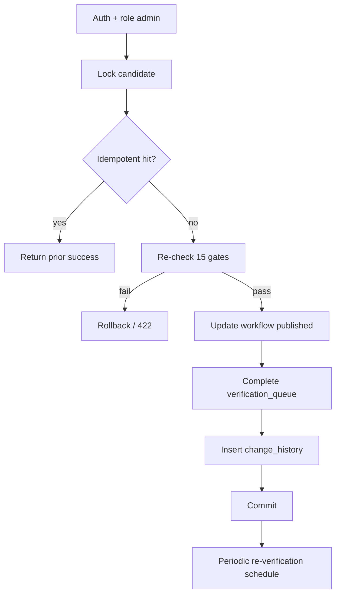

# docs/42-publish-transaction-design.md — published 전환 트랜잭션 설계

최종 갱신: 2026-07-13  
상태: **설계 전용**  
API: `POST /api/admin/discovery/[id]/publish`  
관련: `docs/39`, `docs/40`, `docs/41`

---

## 1. 목표

`workflow_status: verified → published` 를 **원자적으로** 수행한다.  
부분 성공(후보만 published, offer 미비 등)이 남지 않게 한다.  
기존 products 186개를 우회 published 처리하지 않는다.

---

## 2. 진입 조건

- 호출자 role: **admin** (기본)
- candidate 존재, `expectedUpdatedAt` 일치
- 현재 `workflow_status = 'verified'`
- `confirm: true`
- `idempotencyKey` 제공 (재시도 안전)

---

## 3. published 전환 필수 검증 (15항)

서버가 **트랜잭션 시작 직전·직후**에 재확인한다.

| # | 조건 | 실패 코드 힌트 |
|---|------|----------------|
| 1 | `linked_product_id IS NOT NULL` | PUBLISH_GATE_FAILED |
| 2 | `sale_check_status = 'pass'` | … |
| 3 | 공식/신뢰 판매 URL 존재 (candidate URL 또는 offer.purchase_url HTTPS) | … |
| 4 | `product_offers` 중 `product_id=linked` AND `active` AND `verification_status='verified'` AND `stock_status='in_stock'` ≥ 1 | … |
| 5 | 공식 전성분 출처: product_ingredients에 official source_type + source_url | … |
| 6 | 해당 제품(필요 시 variant) product_ingredients 전부 `verification_status='approved'` (또는 명시적 예외 집합) | … |
| 7 | 모든 성분 매핑 완료 **또는** 예외 승인 기록(notes/history) | … |
| 8 | `evidence_check_status='pass'` + 관련 evidence review 완료 정책 | … |
| 9 | `safety_check_status='pass'` | … |
| 10 | 연결 성분에 active high/refer_expert caution 중 미해결 없음 | … |
| 11 | 관련 `verification_queue` publish(또는 종합) `status='approved'` | … |
| 12 | `products.active IS TRUE` (linked) | … |
| 13 | 승인자 id + `published` 시각을 history/new_value에 기록 | … |
| 14 | `product_change_history` INSERT 성공 (같은 트랜잭션) | … |
| 15 | `duplicate_check_status='pass'` 및 미해결 중복 플래그 없음 | … |

추가 거부:
- 가짜 데이터 의심 필드(빈 PMID로 approved 등) — evidence CHECK와 정합
- medicalReferralRequired가 해소되지 않음

---

## 4. 트랜잭션 순서

권장: Postgres 함수 `publish_discovery_candidate(p_id uuid, p_actor text, p_key uuid)`  
또는 서버에서 단일 DB transaction.

```text
BEGIN
  1. LOCK candidate row (SELECT … FOR UPDATE)
  2. idempotency: 동일 key로 이미 published면 성공 응답 재사용 (no-op)
  3. 재검증 15항 (전부 SELECT)
  4. UPDATE product_discovery_candidates
       SET workflow_status='published',
           updated_at=now(),
           notes = notes || publish meta (선택)
     WHERE id=p_id AND workflow_status='verified' AND updated_at=expected
  5. (선택·향후) UPDATE products SET pipeline_status/published_at — 컬럼 생기면
  6. UPDATE verification_queue SET status='approved', reviewed_at=now()
       WHERE entity 연결 and open publish items
  7. INSERT product_change_history (
       product_id, change_type='status',
       old_value={workflow:verified},
       new_value={workflow:published, actor, at, idempotencyKey},
       approved_by=p_actor, reviewed_at=now()
     )
  8. COMMIT
EXCEPTION → ROLLBACK, 오류 코드 반환
```

**부분 커밋 없음.**



---

## 5. 실패·롤백

| 실패 지점 | 동작 |
|-----------|------|
| 게이트 실패 | BEGIN 전 또는 트랜잭션 내 RAISE → ROLLBACK |
| updated_at 불일치 | CONFLICT 409, 변경 없음 |
| queue/history INSERT 실패 | ROLLBACK — candidate도 verified 유지 |
| 동시 publish | FOR UPDATE로 직렬화. 두 번째는 idempotent 또는 CONFLICT |

클라이언트는 재시도 시 **동일 idempotencyKey** 사용.

---

## 6. 동시 수정 방지

1. `expectedUpdatedAt` / ETag  
2. `SELECT … FOR UPDATE` on candidate  
3. UPDATE … WHERE workflow_status='verified' (cas)  
4. 영향 행 0 → CONFLICT 또는 INVALID_TRANSITION  

---

## 7. change_history

필수 필드:
- `product_id` = linked_product_id  
- `change_type` = `status`  
- `old_value` / `new_value` jsonb  
- `approved_by` = actor  
- `reviewed_at` = now()  
- `source_url` = 대표 판매 URL (있으면)

variant 단위 publish가 아니면 `variant_id=null`.

---

## 8. verification_queue

publish 성공 시:
- 해당 candidate의 open `review_type IN ('publish','sale',…)` 중 정책상 완료할 항목을 `approved` + `reviewed_at`  
- 이미 approved면 skip  
- 미승인 필수 queue가 남아 있으면 게이트 11에서 실패 (커밋 전)

---

## 9. 재시도·idempotency

| 상황 | 결과 |
|------|------|
| 네트워크 타임아웃 후 동일 key 재요청 | 이미 published면 200 + 동일 결과 |
| 다른 key로 재publish | INVALID_TRANSITION (이미 published) |
| verified가 아닌데 publish | INVALID_TRANSITION |

idempotency 저장 위치 후보 (향후 테이블, 지금 생성 금지):
- `admin_idempotency_keys(key, route, response_hash, created_at)`  
또는 history.new_value에 key 저장 후 조회로 대체 (MVP).

---

## 10. 검증 SQL (읽기 전용 스케치)

구현 시 서버/함수 내부에서 사용. **지금 원격 실행·적용 금지.**

```sql
-- 4) verified in_stock offer
SELECT EXISTS (
  SELECT 1 FROM public.product_offers o
  WHERE o.product_id = :product_id
    AND o.active = true
    AND o.verification_status = 'verified'
    AND o.stock_status = 'in_stock'
);

-- 6) unapproved ingredients
SELECT COUNT(*) FROM public.product_ingredients pi
WHERE pi.product_id = :product_id
  AND pi.verification_status <> 'approved';

-- 10) high severity open cautions (예시)
SELECT COUNT(*) FROM public.ingredient_cautions ic
JOIN public.product_ingredients pi ON pi.ingredient_id = ic.ingredient_id
WHERE pi.product_id = :product_id
  AND ic.active = true
  AND ic.severity IN ('high', 'refer_expert')
  AND ic.review_status = 'approved';  -- 공개된 경고가 있으면 publish 정책에 따라 block
```

실제 high caution 차단 규칙은 제품 정책과 맞출 것:  
“승인된 고위험 경고가 있으면 추천 제외·피부과 안내” vs “미검토 고위험만 차단”.  
기본 설계: **미해결(미검토) high는 publish 차단**, 승인된 high는 publish 가능하되 추천 엔진이 의료 안내 우선.

---

## 11. publish 이후

1. 핵심 추천 엔진은 `published` + offer 조건만 사용 (엔진 변경은 별 스프린트)  
2. Periodic re-verification 스케줄 등록 (설계만)  
3. seed/추가 제품 자동 INSERT 없음  

---

## 12. 기존 DB 갭 (트랜잭션이 지금은 우회·표시만)

| 갭 | publish 영향 | 조치 |
|----|--------------|------|
| `products.pipeline_status` / `published_at` 없음 | workflow는 candidate에만 기록 | 향후 migration 후보 |
| `product_offers.variant_id` 없음 | offer는 product 단위 게이트 | 향후 migration 후보 |
| `products.brand` text, `brand_id` 없음 | brands 테이블과 미연결 | 향후 migration 후보 |

컬럼 없이도 candidate.workflow=`published` + offer 게이트로 MVP publish는 가능.  
제품 마스터에 published 플래그를 미러링하려면 **별도 migration 후** 트랜잭션 step 5 활성화.

---

## 13. 구현 금지 (현재)

- RPC 배포
- API 구현
- 테스트용 publish 실행
- 기존 186 UPDATE
