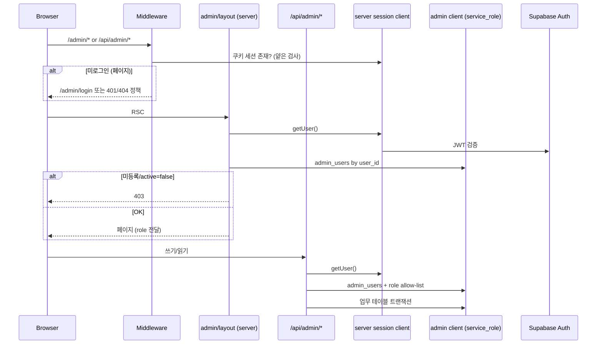
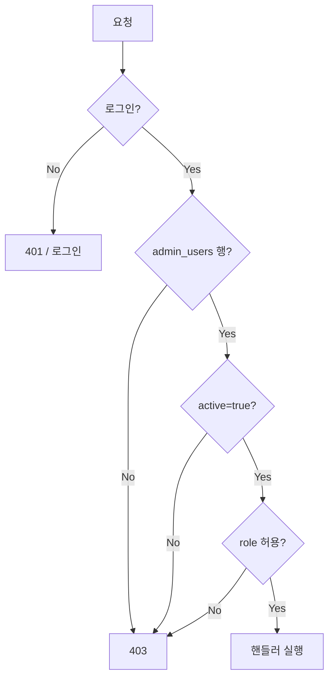

# docs/43-admin-auth-architecture.md — 관리자 인증 아키텍처

최종 갱신: 2026-07-13  
상태: **설계 전용** (구현·migration·환경변수·원격 변경 없음)  
관련: `docs/41`, `docs/44`~`docs/46`

---

## 1. 현재 인증 상태 (조사)

| 항목 | 상태 |
|------|------|
| 관리자 로그인 | 없음 |
| middleware | 없음 |
| `/api/admin/*` | 없음 |
| `@supabase/ssr` | 미설치 |
| Zod | 미설치 |
| `src/lib/supabase.ts` | anon client 단일 export |
| service_role client | 없음 |
| 앱의 Auth import | 없음 |
| `/admin/catalog-review` | Server Component. `NODE_ENV !== "development"`이면 `notFound()` |
| production catalog-review | 서버에서 404 (클라이언트 숨김 아님) — **무인증 개발 화면** |
| `admin_*` 테이블 | **없음** |
| role 관련 public 함수 | 조사상 없음 |

### profiles (원격, 민감값 미보고)

| 항목 | 값 |
|------|-----|
| PK | `id uuid` |
| FK | `id → auth.users(id) ON DELETE CASCADE` |
| `role` | `text` nullable, default `'member'` — **CHECK 없음** |
| RLS | **ON** |
| 정책 | INSERT 본인 / SELECT 본인 / **UPDATE 본인** |
| UPDATE with_check | **컬럼 제한 없음** → 본인이 `role` 포함 전 컬럼 수정 가능 |
| anon/authenticated GRANT | SELECT·INSERT·UPDATE·DELETE·TRUNCATE·… **전부** |
| 행 수 | 1 (값 미보고) |

### auth.users (구조만)

- 연결 가능 컬럼: `id`, `email`, `raw_app_meta_data`, `raw_user_meta_data`, `banned_until` 등  
- **실데이터·UUID·이메일은 조회·보고하지 않음**  
- `auth.users`에 custom 컬럼 추가 금지

---

## 2. 방식 비교

### A안 — `profiles.role` 사용

**장점**
- 테이블 추가 최소
- 이미 `role` 컬럼·FK 존재
- 조회 경로가 단순

**단점·위험**
- **치명적:** RLS `본인만 수정`이 role 변경을 막지 않음 → 로그인 사용자가 자신을 admin으로 승격 가능
- role CHECK 없음 (`member` 기본값만)
- profiles는 소비자 PII(phone/address)와 권한이 한 테이블에 혼재
- anon/authenticated에 UPDATE 등 넓은 GRANT → RLS 실수 시 즉시 권한 탈취
- 권한 변경 이력이 profiles에 없음
- profiles UPDATE 정책을 “role 제외”로 고치려면 migration + 기존 앱(미래) 호환 검증 필요

**최소 migration (A를 고집할 경우)**
1. role CHECK / allow-list  
2. UPDATE 정책에서 role·id 변경 금지 (`WITH CHECK` + 트리거)  
3. REVOKE 과도한 DML  
4. admin만 role 변경 가능한 SECURITY DEFINER 함수  

→ 고쳐도 “소비자 프로필 = 권한 저장소” 결합은 남음. **권고하지 않음.**

### B안 — 별도 `admin_users` 테이블 (권고)

예상 구조: `docs/45`

**장점**
- 일반 profile과 관리자 권한 **완전 분리**
- anon/authenticated에 **GRANT 0 + 정책 0** 가능 (관리자 4테이블과 동일 패턴)
- 브라우저에서 권한 변경 불가 (service_role/서버만)
- `active`로 즉시 차단
- `admin_role_history`로 감사
- admin/reviewer/researcher/catalog_manager/read_only 확장 용이
- profiles.role은 소비자용(`member` 등)으로 남겨도 관리자 게이트에 사용 안 함

**단점**
- 테이블 1~2개 + migration 필요
- 권한 조회 시 join 1회 (service_role)
- 첫 admin bootstrap 절차 필요

**운영 복잡도:** 소규모 팀에 적절. 과도한 IdP/SSO 불필요.

### C안 — Auth `app_metadata` role

**장점**
- JWT에 실려 서버에서 claim 확인 가능
- 클라이언트가 app_metadata를 직접 못 바꿈 (Admin API 필요)

**단점**
- JWT 갱신 전까지 이전 role 잔존 가능
- 변경은 Dashboard/Admin API — 앱 내 감사·active 플래그와 별도 관리
- 이력 테이블이 여전히 필요
- 역할 5종·비활성화·작성/승인 분리와 맞추려면 결국 DB 미러 필요
- 현재 앱에 Auth 세션 인프라 없음 → B와 동일한 선행 작업 + metadata 운영 부담

**적합성:** 보조 claim으로는 가능하나 **단일 권한 저장소로는 비권고.**

---

## 3. 최종 권고

| 결정 | 권고 |
|------|------|
| profiles.role | **관리자 권한에 사용하지 않음** (소비자 필드로만 존치) |
| admin_users | **채택** — 권한의 SSOT |
| app_metadata | **사용하지 않음** (향후 최적화 여지만 남김) |
| 첫 admin | Dashboard SQL 수동 INSERT (`docs/45`) |
| /admin 보호 | **middleware(경로 가드) + `src/app/admin/layout.tsx` 서버 가드** 조합 |
| /api/admin | **`withAdminAuth(handler, roles)`** |
| service_role | `src/lib/supabase/admin.ts` (서버 전용, 파일 미생성 단계) |

권고 기준 충족: 브라우저 권한 변경 불가, 서버 검증, 이력, 5 role, 최소 복잡도.

---

## 4. 인증 흐름

---

## 5. 세션 검증 함수 (설계만 — 파일 미생성)

| 함수 | 입력 | 반환 | 실패 | 사용처 | 서버 전용 |
|------|------|------|------|--------|-----------|
| `getAdminSession()` | 없음(쿠키) | `{ userId, role, active } \| null` | null | layout, API | ✓ |
| `requireAuthenticatedUser()` | — | `{ userId }` | throw 401 | 공통 | ✓ |
| `requireAdminUser()` | — | `{ userId, role }` | 401/403 | /admin layout | ✓ |
| `requireAdminRole(allowed)` | role[] | session | 403 | API·민감 페이지 | ✓ |

규칙:
- **클라이언트 컴포넌트에서 호출 금지**
- admin_users 조회는 **admin client(service_role)** 또는 SECURITY DEFINER 함수만 (authenticated가 admin_users SELECT 불가 전제)
- 화면 숨김만으로 권한 대체 금지

검증 단계 순서:
1. 로그인 여부  
2. user id  
3. admin_users 등록  
4. active  
5. role  
6. 화면/API 작업 권한  

---

## 6. Supabase client 분리 (설계)

| Client | 키 | 용도 | 금지 |
|--------|-----|------|------|
| A browser | anon | 소비자 세션·공개 SELECT | service_role |
| B server session | anon + 쿠키 | getUser, RLS 적용 읽기 | 관리자 4테이블 쓰기 |
| C server admin | service_role | 관리자 쓰기·admin_users 조회 | 브라우저 import |

파일 후보 (이번 단계 **생성 안 함**):
- `src/lib/supabase/browser.ts`
- `src/lib/supabase/server.ts`
- `src/lib/supabase/admin.ts`
- `src/lib/auth/admin.ts`
- `src/lib/auth/roles.ts`
- `src/lib/auth/permissions.ts`

기존 `src/lib/supabase.ts`는 구현 시 browser로 이전·호환 re-export 검토.

---

## 7. 환경변수 (설계만 — 추가 안 함)

| 이름 | 공개 | 용도 |
|------|------|------|
| `NEXT_PUBLIC_SUPABASE_URL` | 예 | URL |
| `NEXT_PUBLIC_SUPABASE_ANON_KEY` | 예 | anon |
| `SUPABASE_SERVICE_ROLE_KEY` | **아니오** | admin client만 |

규칙: `NEXT_PUBLIC_` 금지(service_role), 로그·에러 메시지 비노출, `.env.local` Git 제외(이미 `.env*`), `.env.example`에는 이름만.

---

## 8. /admin 보호 권고

**조합:** middleware(경로·쿠키 유무) + `app/admin/layout.tsx`에서 `requireAdminUser()`  
- 미로그인 → `/admin/login` (또는 정책상 404)  
- 비관리자 / inactive → **403**  
- 클라이언트 “로그인 후 숨김” **금지**  
- `/admin/catalog-review`: production은 기존 `notFound()` 유지 + **admin layout 편입 시 관리자만** (아래 §11 연계)

middleware만으로는 role DB 조회를 무겁게 넣지 말고, **최종 권한은 layout/API에서 admin_users 확인.**

---

## 9. /api/admin/* 보호 권고

공통 wrapper: `withAdminAuth(handler, allowedRoles)`

매 요청:
1. 세션  
2. admin_users + active  
3. role ∈ allowedRoles  
4. body validation  
5. 작업 권한  
6. 감사 로그(업무 변경 시)  
7. 내부 오류 숨김  

HTTP: 401 / 403 / 400 / 409 / 422 / 500 (`docs/39`와 정합)

---

## 10. /admin/catalog-review 처리 권고

| 항목 | 판단 |
|------|------|
| production 무인증 접근 | `NODE_ENV` 서버 가드로 **404** — 현재도 서버 측 |
| 제거? | 당분간 유지 (로컬 카탈로그 검증 도구) |
| 새 체계 편입? | `/admin` layout 아래로 두면 **개발에서도 로그인+admin 필요** 가능 |
| 권고 | (1) production 404 유지 (2) 구현 후 admin layout 적용 (3) 가능하면 `NODE_ENV` + admin 이중 조건 |

---

## 11. 관리자 UI 구현 전 필수 완료 항목

1. 본 설계 승인  
2. `admin_users` + `admin_role_history` migration 작성·사전검사·백업·적용  
3. 첫 admin Dashboard SQL bootstrap  
4. `SUPABASE_SERVICE_ROLE_KEY` 로컬 설정 (커밋 금지)  
5. server session + admin clients  
6. `requireAdmin*` + `/admin` layout (+ middleware)  
7. catalog-review 보호 강화  
8. 보호 테스트 통과  

이후: `/api/admin/*` · 검증 UI (`docs/38`~`42`)

---

## 12. 이번 단계에서 하지 않는 것

코드·middleware·API·migration·원격·환경변수·계정·commit/push 전부 금지.
